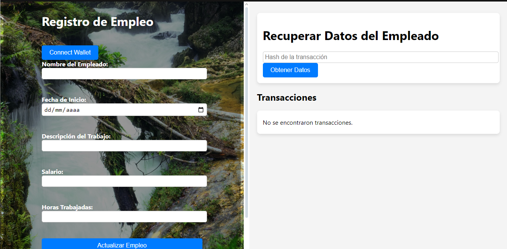
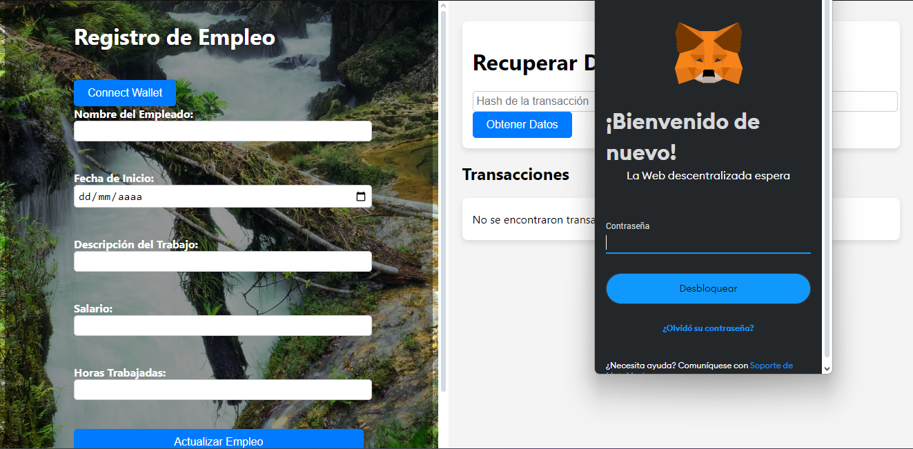
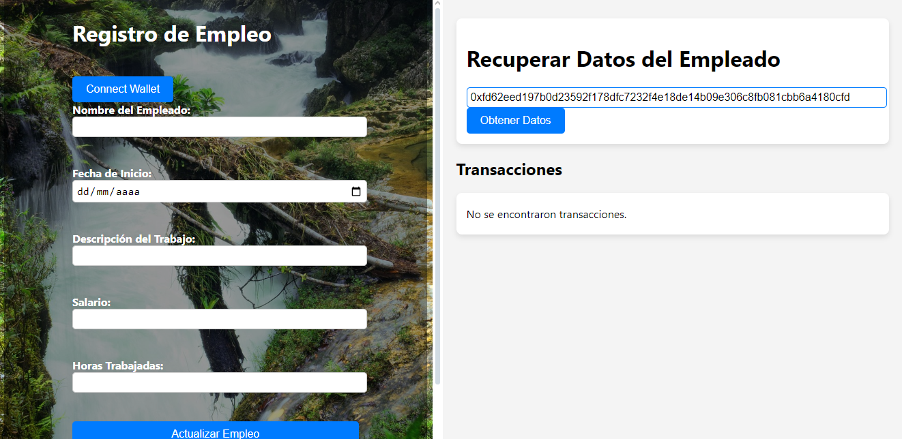
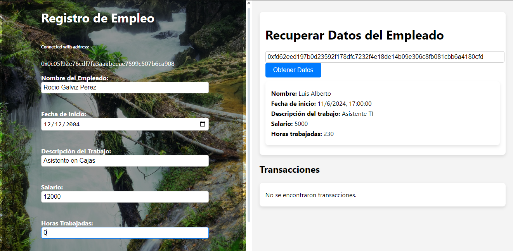

# 🔗 Uso de Contratos Inteligentes en Aplicación Descentralizada

Esta es una **aplicación descentralizada (dApp)** diseñada para crear una red segura donde se registre la contratación de empleados mediante **contratos inteligentes**, asegurando la transparencia y protección en dicho proceso.  
La aplicación presentada es funcional. Sin embargo, representa una parte de lo que sería un sistema integrado como producto final.

La aplicación está construida utilizando **Solidity**, **JavaScript**, **React**, **HTML** y **CSS**, aprovechando la infraestructura blockchain para garantizar la inmutabilidad y la seguridad de los datos.

---

## 🌟 **Características Principales**
- Registro de contratos laborales mediante **contratos inteligentes** en la blockchain.
- Garantía de seguridad y transparencia en los acuerdos entre empleadores y empleados.
- Interfaz web desarrollada con **React**.
- Integración con billeteras como **MetaMask** para gestionar transacciones.
- Almacenamiento descentralizado de datos clave en la blockchain.

---

## **Vista Previa de la Aplicación**
### **Interfaz Principal**
La interfaz principal es la siguiente:



Proporciona un formulario para el registro de nuevos empleados y permite realizar consultas mediante el hash de las transacciones.

### **Acceso a la Wallet MetaMask**
Se realiza la vinculación de la wallet con la web, asociando los ingresos a la cuenta conectada.  
Aparecerá la dirección de la wallet una vez esté conectada.



### **Consulta de Contratos**
Al ingresar el hash de una transacción, será posible verificar los datos del empleado asociado.

  


---

## ⚙️ **Requisitos del Sistema**
- **Navegador**: Compatible con Chrome, Firefox u Opera.
- **MetaMask**: Extensión de billetera para interacciones con la blockchain.
- **Node.js**: Versión 14 o superior.
- **Frameworks**:
  - React
  - Web3.js
### **Para poder probarlo, debes cambiar los datos tales como cuenta, api keys, entre otros.
---

## 🚀 **Instalación**
1. Clona este repositorio:
   ```bash
   git clone https://github.com/Fernanda3920/Contratos-Inteligentes-.git
